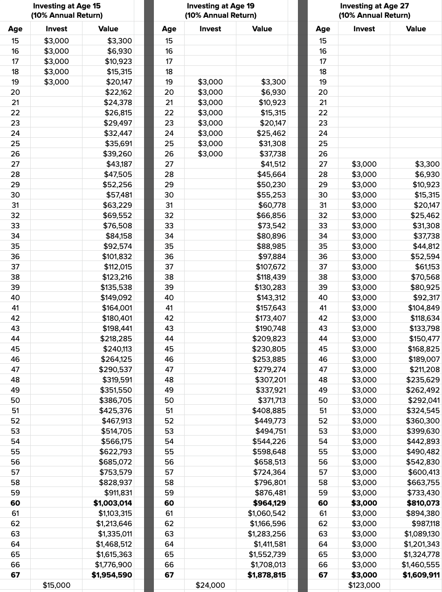

# After Thoughts

## Time value of Money

Assuming 10% annual return rate on investment, which can be expected out of the market.

It sure looks good on paper, but think about it, even if you get 6% or 8% annual return, your total principal investment will be significantly lower the earlier you choose to start investing and still come out wealthier. Also it reduces the stress of having to continue investing for the rest of your life. And this also means that you could invest in other goals in later years of your life.

## Power of pretax investing

TBD

- Power of compounding in tax-deferred growth
- vs returns from market at a higher rate

## Traditional vs Roth IRA

TBD

- What is each?
- When to use traditional?
- When to use roth?
